<div align="center">



</div>

---

```bash
┌──(tolga㉿dev)-[~]
└─$ cat focus.txt
```

```
■ fullstack_dev        // end-to-end ownership, from db schema to ui interaction
■ api_design           // contracts first, versioned, predictable, self-documenting
■ frontend_craft       // state management, performance, accessibility — not just markup
■ backend_architecture // layered, stateless where possible, easy to reason about
■ saas_mindset         // build for scale, design for change, ship for humans
```

---

```bash
┌──(tolga㉿dev)-[~]
└─$ ./principles --list
```

```
[✔] readable_over_clever    // code is read 10x more than written — optimize for that
[✔] boundaries_matter       // clear interfaces beat tight coupling every time
[✔] dry_but_not_obsessed    // abstract when it's real duplication, not coincidence
[✔] delete_code             // the best code is no code; less to maintain, less to break
[✔] fail_loudly             // silent failures are the hardest bugs to find
[✔] names_are_design        // a good name makes a comment unnecessary
[✔] own_the_full_stack      // understand what happens on both ends of the wire
[✔] systems_over_heroics    // sustainable pace, consistent quality, no cowboy deploys
```

---

```bash
┌──(tolga㉿dev)-[~]
└─$ cat contact.sh
```

```bash
#!/bin/bash
EMAIL="bayraktolga28@gmail.com"
GITHUB="github.com/tolgabayrak"
echo "Open to: remote · freelance · collaboration"
```

---

```bash
┌──(tolga㉿dev)-[~]
└─$ █
```